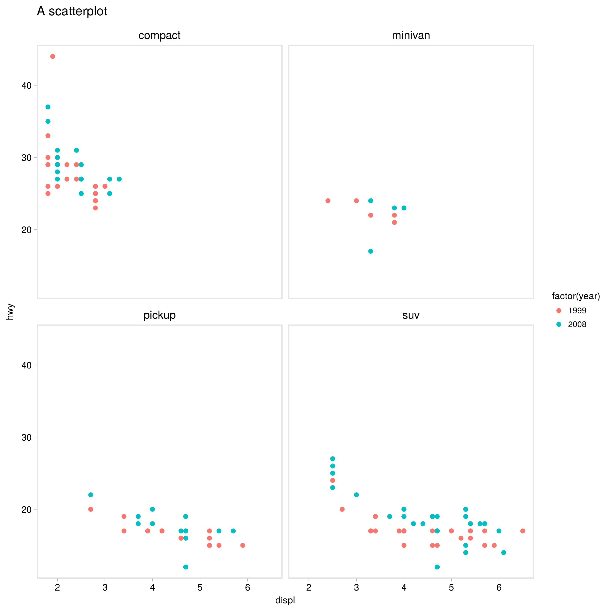
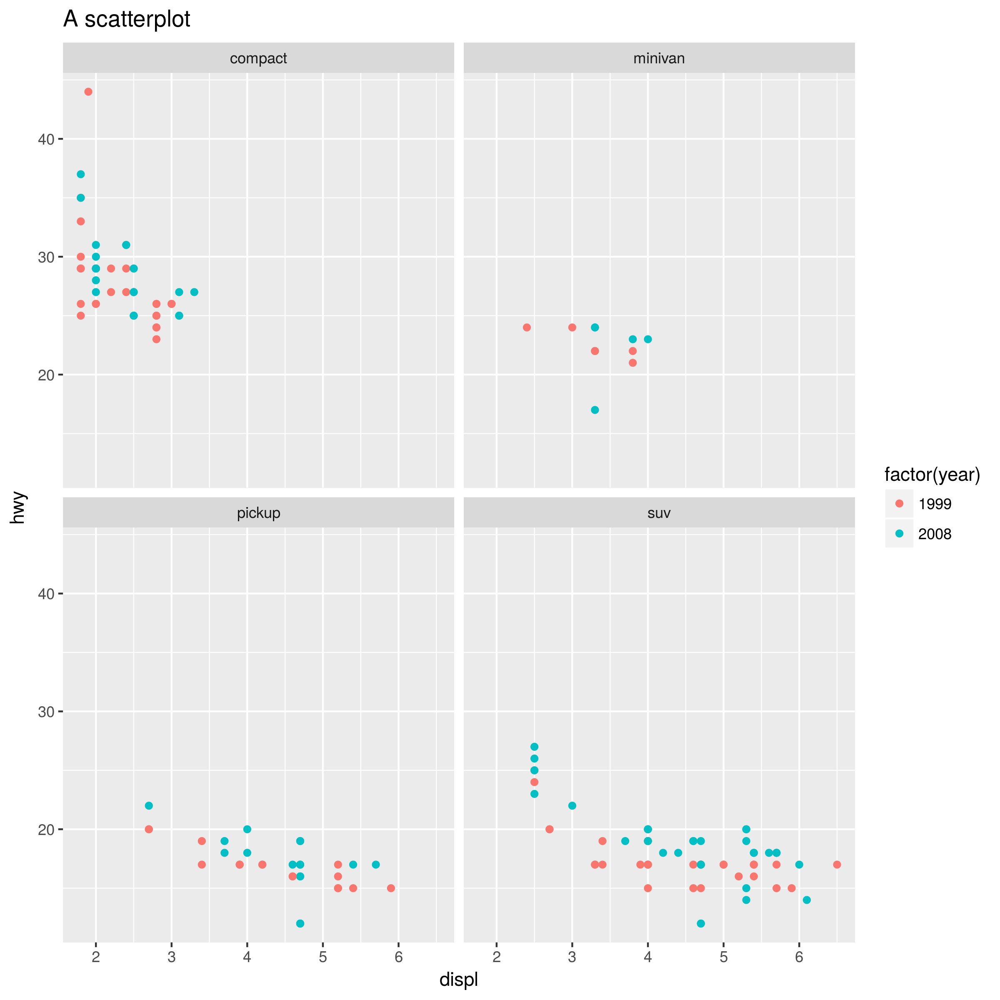

[](https://travis-ci.org/sjessa/ggmin)

# ggmin
A clean, minimalist theme for ggplot2


# install
```
install.packages("devtools")  
devtools::install_github("sjessa/ggmin")
```

# use
```
library(ggmin)

df %>%
  ggplot(aes(x = X, y = y)) +
  ... + # Other layers (geoms, etc.) here
  ggmin::theme_min()

```

# example

With `ggmin::theme_min()`:
```
library(ggmin)

mpg %>% 
  filter(class %in% c("compact", "suv", "pickup", "minivan")) %>% 
  ggplot(aes(x = displ, y = hwy)) +
  geom_point(aes(colour = factor(year))) +
  facet_wrap(~ class) +
  ggtitle("A scatterplot") +
  ggmin::theme_min()

```



The `ggplot2` default:


